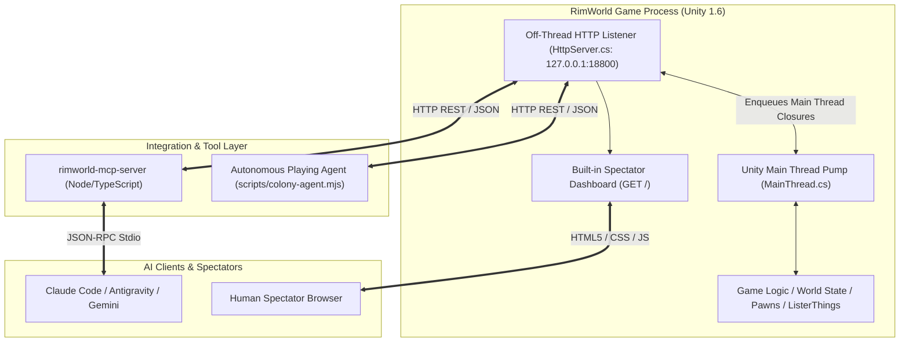

# RimWorld AI Bridge & Autonomous Agent Platform

[](https://rimworldgame.com/)
[](https://modelcontextprotocol.io/)
[](#architecture)
[](#colony-benchmark)

A command-driven control bridge, Model Context Protocol (MCP) server, and autonomous playing platform for **RimWorld 1.6** (all DLCs: Royalty, Ideology, Biotech, Anomaly). Enables LLMs and autonomous agents (Claude, Antigravity, OpenAI, Gemini) to play complete, non-cheated RimWorld civilizations without Dev Mode or god mode.

---

## Highlights

- **Embedded HTTP REST Engine**: High-performance HTTP server hosted directly inside RimWorld via Mono and Unity runtime on `http://127.0.0.1:18800`.
- **Zero Dev Mode / Pure Gameplay**: Full control surface for orders, blueprints, work priorities, zone designations, and research while maintaining 100% gameplay legitimacy.
- **Model Context Protocol (MCP)**: Native stdio MCP server (`rimworld-mcp-server`) exposing 64 typed tools for instant integration into Claude Code, Antigravity, Cursor, and Gemini CLI.
- **Single-Agent Ownership Locking**: Exclusive lease reservation (`/agent/claim`, `/agent/release`) with `X-Agent-Id` routing to prevent multi-agent race conditions.
- **Autonomous Play Agent**: Production controller (`scripts/colony-agent.mjs`) implementing decision trees derived from the comprehensive RimWorld Optimization Guide.
- **Spectator Web Dashboard**: Live web UI served at `http://127.0.0.1:18800/` showing colony status, pawn cards, and event telemetry in real time.

---

## Architecture



---

## Quickstart

### Prerequisites

- **RimWorld 1.6** (macOS GOG or direct build at `/Applications/RimWorld.app`, or Steam).
- **.NET SDK 8+**: `brew install dotnet`
- **Node.js 18+**: `node -v`

### 1. Compile and Install the Bridge Mod

```bash
# Build C# DLL, install to RimWorld/Mods, and activate in ModsConfig.xml
./scripts/install-mod.sh
```

### 2. Build the MCP Server

```bash
cd mcp
npm install
npm run build
cd ..
```

### 3. Register MCP Server with AI Clients

```bash
# Auto-registers the rimworld MCP server in Claude Code, Antigravity, and Codex
./scripts/register-clients.sh
```

### 4. Run Smoke Tests

```bash
# Verify mod communication and MCP tool registration
node mcp/scripts/smoke.mjs rimworld_status rimworld_health
```

---

## Autonomous Play Agent (`colony-agent.mjs`)

The autonomous agent script continuously monitors colony vitals, fulfills pawn needs, advances technologies, and repels hostile threats using heuristics from the RimWorld Optimization Guide.

```bash
# Run 20 autonomous turns at speed 3 with daily auto-saving
node scripts/colony-agent.mjs --turns=20 --step-ms=2500 --speed=3
```

### Script Execution Loop

1. **Lease Renewal**: Claims exclusive control lease (`/agent/claim`) and issues heartbeats every 60 seconds.
2. **Atomic Observation**: Queries `GET /snapshot` for an all-in-one payload (tick, colonists, needs, alerts, resources, research, letters, and hostiles).
3. **Emergency & Combat Defense**:
   - Detects incoming hostiles or manhunter beasts.
   - Automatically drafts combat-capable colonists and positions them behind barricades.
   - Orders long-range rifle volleys and undrafts upon threat neutralization.
4. **Medical Care**:
   - Detects wounded or bleeding pawns.
   - Issues immediate bed rest and orders doctor pawns to bandage wounds with industrial medicine.
5. **Resource Management**:
   - Scans surrounding area for mature trees (`growth >= 0.8`) and designates lumber harvesting when wood drops below 80.
   - Periodically unforbids freshly dropped supplies and resources.
6. **Infrastructure & Comfort**:
   - Ensures bedroom/barracks shelter is enclosed, roofed, and heated to comfortable room temperature (20C to 23C).
   - Establishes wooden dining tables and chairs to prevent the "Ate without table" debuff.
   - Maintains an outdoor campfire with active `CookMealSimple` bills.
7. **Research Automation**:
   - Keeps research bench staffed and automatically transitions to the next tech in the optimization tree upon completion.
8. **Daily Save Milestones**:
   - Automatically writes a recovery save (`NewDawn_DayX`) at the start of each in-game day.

---

## Colony Benchmark ("NewDawn")

A continuous benchmark was run from day one under Cassandra Classic, Adventure Storyteller, without Dev Mode:

| Metric | Day 1 (Crashlanded) | Day 11 (Current State) |
|---|---|---|
| **Population** | 3 colonists, 0 shelter | 3 colonists, 100% healthy |
| **Shelter** | None (Sleeping outside) | 9x7 Roofed, heated (22.2C) wooden barracks |
| **Furniture** | None | 3 Beds, Dining Table, 2 Chairs, Torch Lamp |
| **Colonist Mood** | 38% to 51% | 57% to 69% (Zero mental break risk) |
| **Research** | 0% | Batteries at 81% (bench continuously staffed) |
| **Food & Cooking** | 30 packaged survival meals | 36 meals, 24-cell rice field, outdoor campfire |
| **Defense** | Unprepared | 3 Wooden Barricades; Legendary Bolt-Action Rifle |
| **Combat Record** | 0 threats | Manhunter attack neutralized; 10 wounds tended |
| **Save Checkpoints** | `NewDawn_Day1.rws` | `NewDawn_Day9.rws`, `Day10.rws`, `Day11.rws` |

---

## Complete API Reference

Every route runs on the Unity main thread via `MainThread.cs`. Mutating routes require the `X-Agent-Id` header when a lease is active.

### Observation Routes

| Method | Route | Description |
|---|---|---|
| `GET` | `/health` | Fast off-thread health check (uptime, request count, loading state). |
| `GET` | `/status` | Engine state, tick, game speed, biome, map IDs, active mods. |
| `GET` | `/snapshot` | Atomic state: colonists, needs, hostiles, alerts, resources, research, letters. |
| `GET` | `/map` | Detailed map summary: weather, season, outdoor temp, zones, designations. |
| `GET` | `/pawns` | Pawn list with filters (`role=colonist`, `detail=1`). |
| `GET` | `/pawn/{id}` | Full pawn sheet: skills, traits, passions, thoughts, apparel, health. |
| `GET` | `/things` | Query items, buildings, and plants by category, def, rect, or forbidden flag. |
| `GET` | `/resources` | Stockpiled items counted by defName and total human-edible nutrition. |
| `GET` | `/alerts` | Active HUD alerts and priority warnings with explanations. |
| `GET` | `/events` | Incremental event feed: battle logs, letters, messages (`?since=seq`). |
| `GET` | `/cell` | Cell inspector: terrain, standability, walkability, roof, zone, temperature. |
| `GET` | `/defs` | Query game DefDatabase for buildings, items, plants, recipes, research. |

### Pawn & Combat Orders

| Method | Route | Description |
|---|---|---|
| `POST` | `/draft` | Draft or undraft colonist: `{"pawn": 612, "drafted": true}` |
| `POST` | `/move` | Walk order: `{"pawn": 612, "x": 55, "z": 105, "draft": true}` |
| `POST` | `/attack` | Ranged or melee attack target: `{"pawn": 612, "target": 24399}` |
| `POST` | `/job` | Generic job queue: `{"pawn": 612, "job": "TendPatient", "targetA": "616"}` |
| `POST` | `/equip` | Equip weapon or wear apparel: `{"pawn": 620, "thing": 3927}` |
| `POST` | `/work/bulk` | Configure manual work priorities: `{"pawn": 612, "priorities": {"Doctor": 1}}` |
| `POST` | `/pawn/settings` | Hostility response (`Flee`, `Attack`), medical care tier, allowed area. |

### Construction, Zones & Bills

| Method | Route | Description |
|---|---|---|
| `POST` | `/build` | Place building blueprint: `{"def": "Wall", "stuff": "WoodLog", "x": 84, "z": 114}` |
| `POST` | `/build/bulk` | Batch place blueprints: `{"items": [{"def": "Wall", "x": 84, "z": 114}, ...]}` |
| `POST` | `/designate` | Designate work: `{"type": "chop", "things": [10659, 10999]}` |
| `POST` | `/zone` | Create zone: `{"type": "growing", "rect": {"x": 88, "z": 86, "w": 7, "h": 7}, "plant": "Plant_Rice"}` |
| `POST` | `/zone/update` | Modify zone priority, allowed sowing, or cell boundaries. |
| `POST` | `/forbid` | Forbid or allow items on map: `{"all": true, "forbidden": false}` |
| `POST` | `/bill` | Add workbench bill: `{"thing": 30689, "recipe": "CookMealSimple", "mode": "target", "count": 10}` |
| `POST` | `/research` | Set active research project: `{"project": "Batteries"}` |

### Time Pacing & Simulation

| Method | Route | Description |
|---|---|---|
| `POST` | `/speed` | Set game speed (`0`=pause, `1`=normal, `2`=fast, `3`=superfast, `4`=ultra). |
| `POST` | `/wait` | Advance simulation by N ticks then pause: `{"ticks": 1200, "speed": 3}`. |
| `POST` | `/game/save` | Save game state to disk: `{"name": "NewDawn_Day11"}`. |
| `POST` | `/game/load` | Load an existing save file by name. |
| `POST` | `/game/new` | Start a new colony programmatically with scenario, seed, and difficulty. |

### Agent Ownership Leasing

| Method | Route | Description |
|---|---|---|
| `POST` | `/agent/claim` | Acquire exclusive lease: `{"agent": "colony-agent", "leaseSec": 300}` |
| `POST` | `/agent/release` | Release lease voluntarily: `{"agent": "colony-agent"}` |
| `GET` | `/agent/owner` | Inspect current lease holder and remaining lease seconds. |

---

## Optimization Guide Integration

The platform incorporates core principles from the community RimWorld Optimization Guide:

1. **Crop Selection**:
   - **Rice** on fertile soil early game for fast harvest cycles.
   - Transition to **Corn** once food stockpiles stabilize for superior labor-to-nutrition efficiency.
   - Constant overproduction of **Healroot** for herbal medicine independence.
2. **Nutrition Management**:
   - Maintain a buffer of **Simple Meals** (`target: 10`) at campfires or fueled stoves.
   - Keep butcher table set to `ButcherCorpseFlesh` (`forever`) to process wild game.
3. **Room Impressiveness**:
   - Enclose bedrooms to immediately eliminate the -4 "Slept outside" debuff.
   - Maintain indoor temperatures between 20C and 23C to prevent "Slept in cold" and "Slept in heat" debuffs.
   - Provide dining tables and chairs to completely avoid the -3 "Ate without table" penalty.
4. **Combat Tactics**:
   - Utilize ranged bolt-action rifles to kite hostiles from maximum range (37 tiles).
   - Construct defensive barricades at chokepoints to ensure 55% cover for defenders.

---

## Directory Structure

```text
rimworld-ai/
├── mod/                               # C# In-Game Mod
│   ├── About/                         # Mod manifest (About.xml, Preview.png)
│   ├── 1.6/Assemblies/                # Compiled mod DLL (RimWorldAIBridge.dll)
│   └── Source/RimWorldAIBridge/
│       ├── BridgeMod.cs               # Mod entrypoint & settings
│       ├── HttpServer.cs              # HTTP listener & lease management
│       ├── MainThread.cs              # Unity main thread dispatch pump
│       ├── EventLog.cs                # In-memory telemetry circular buffer
│       └── Api/
│           ├── Routes.cs              # Base & observation routes (/snapshot, /health)
│           ├── ActionRoutes.cs        # Pawn orders, building, zones, bills, combat
│           ├── GameRoutes.cs          # Save, load, new game, storyteller controls
│           ├── Lookup.cs              # Def & Thing resolver utilities
│           ├── Serializers.cs         # JSON serializers for pawns, items, maps
│           ├── Screenshot.cs          # Native PNG screen capture
│           └── Dashboard.cs           # Spectator web dashboard HTML/CSS
├── mcp/                               # Model Context Protocol Server
│   ├── src/
│   │   ├── index.ts                   # MCP server implementation (64 tools)
│   │   ├── client.ts                  # HTTP bridge client with lease headers
│   │   └── guide.ts                   # Embedded optimization guide reference
│   ├── scripts/smoke.mjs              # MCP stdio smoke test runner
│   └── package.json
├── scripts/
│   ├── colony-agent.mjs               # Autonomous colony play controller
│   ├── install-mod.sh                 # Mod build and deployment script
│   └── register-clients.sh            # Client configuration script (Claude/Antigravity)
└── PROGRESS.md                        # Active benchmark progress and log
```

---

## License

MIT License. RimWorld is a trademark of Ludeon Studios. This project is an independent open source mod and agent integration platform.
