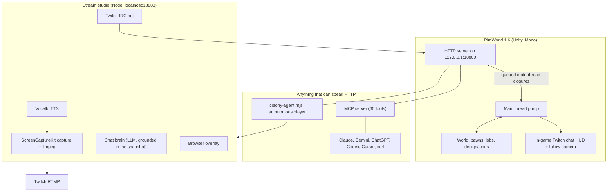

# RimWorld AI Bridge

[](https://rimworldgame.com/)
[](https://modelcontextprotocol.io/)
[](LICENSE)

In the RimWorld fiction, the most capable minds in the universe are not people. They are persona
cores and archotechs: machine intelligences that plan, build and decide. This project puts one of
them in the player's chair.

The bridge embeds an HTTP server inside a running RimWorld 1.6 process. Any AI agent, running
anywhere on the machine, can observe the colony and issue real orders through it: draft a colonist,
designate a harvest, place a blueprint, set a research project, accept a letter, open a trade. No
dev mode. No god mode. No mouse automation. The agent plays the same game a human plays, through
the same rules.

On top of the bridge sit three things: an MCP server so any Model Context Protocol client can play,
an autonomous agent that plays on its own, and a streaming studio that broadcasts the run to Twitch
with a voice, an on-screen HUD, and viewers who can talk to the AI in chat.

---

## What a viewer sees

A colony being played in real time by a machine, and the machine explaining itself:

- **The game window**, captured and broadcast at 1080p30 with the game's own audio.
- **An in-game chat HUD** in the top right corner of RimWorld itself, showing live Twitch messages.
- **A following camera** that tracks whichever colonist is doing something worth watching, zooming
  in for sleep and meals, out for a fight.
- **A voice.** The agent narrates its decisions through a local neural text-to-speech model.
- **Chat commands.** Viewers run `!status`, `!colonists`, `!research`, `!ask <question>` and the AI
  answers from the live colony state, not from a script.
- **A browser overlay** at `/overlay` for colonist cards, resources, research and the AI's reasoning.

---

## Architecture



---

## Quickstart

Requires macOS with RimWorld 1.6 installed, .NET SDK, Node 18 or newer.

```bash
# 1. Build and install the mod into RimWorld, then launch the game.
./scripts/install-mod.sh
open -a RimWorld

# 2. Confirm the bridge is alive (works on the main menu).
curl -s http://127.0.0.1:18800/status | jq

# 3. Start a colony. Either load a save in the game, or start one through the bridge:
curl -s -X POST http://127.0.0.1:18800/game/new -H 'Content-Type: application/json' \
  -d '{"scenario":"NakedBrutality","storyteller":"Cassandra","difficulty":"Rough","neolithic":true,"curatePawn":true,"colonyName":"Persona Core"}'

# 4. Let the autonomous agent play it.
node scripts/colony-agent.mjs --speed=3
```

To let any MCP client play instead, build and register the MCP server:

```bash
cd mcp && npm install && npm run build && cd ..
./scripts/register-clients.sh
```

That script registers the server with Claude Code, Antigravity, Gemini CLI, Codex CLI, Cursor and
Claude Desktop, and prints a generic config block for anything else.

Read [PLAYGUIDE.md](PLAYGUIDE.md) for the full contract, every route, per-client wiring and the
strategy manual.

---

## The stream studio

```bash
cp .env.example .env     # fill in TWITCH_CHANNEL and TWITCH_STREAM_KEY
node stream-app/server.mjs
open http://localhost:18888
```

The dashboard has a start and stop button, live encoder telemetry, the chat monitor and a preview of
the broadcast overlay. Visit `/auth/twitch` to connect a bot account for two-way chat and to let the
studio set the stream title and category.

The capture path deserves a note: it uses ScreenCaptureKit to capture **only the RimWorld window**,
scaled and letterboxed to a fixed 1920x1080 canvas, plus system audio with the microphone explicitly
excluded. If RimWorld restarts mid-broadcast the capture emits black frames and reattaches to the new
window, so the RTMP session survives. Encoding is hardware accelerated through `h264_videotoolbox`.

The voice is [Vocello](https://github.com/PowerBeef/Vocello), a local Qwen3-TTS model running on
Apple silicon. Clips are synthesized in batches and cached by text, with the Apple neural Siri voice
as a fallback. Nothing is sent to a cloud TTS service.

Chat replies come from a language model that is handed the live colony snapshot as grounding, so the
AI answers questions about the colony with facts from the colony. When no model is reachable it falls
back to rule-based replies built from the same snapshot. It does not invent numbers.

---

## The campaign rules

The house rules for a run, enforced by convention rather than by code:

| Rule | Why |
|---|---|
| No dev mode, no god mode | `/status` reports `devMode` and `godMode`. Both stay false. |
| No mouse or keyboard automation | Every action is a real game order through the bridge. |
| Colonist needs come first | Food, rest, mood, medical care outrank every build order. |
| No cheesing technology | Research is earned. Scavenged gear is fine, skipping eras is not. |
| Save daily | The agent writes a dated save every in-game day. |

The reference campaign is Naked Brutality, Cassandra Classic, Strive to Survive, temperate forest,
large hills, starting at neolithic tech: one colonist with nothing, growing into a real colony.
The `/game/new` route curates the founder by scoring hundreds of random rolls on skills, passions,
traits, health and age and keeping a strong one. Nothing about the pawn is edited, so the start stays
a legitimate roll, just a well chosen one.

---

## Any AI can play

The bridge is not tied to one model or one vendor. [PLAYGUIDE.md](PLAYGUIDE.md) is written for any
agent: Claude, Gemini, ChatGPT, Codex, Cursor, a LangChain script, or a shell loop built out of
`curl`. It documents the connection contract, the agent lease, the observe and act loop, every route
with its parameters, per-client configuration, and a strategy manual for actually surviving.

---

## Project layout

```
mod/                    RimWorld 1.6 mod (C#): HTTP server, routes, chat HUD, follow camera
  Source/RimWorldAIBridge/
    BridgeMod.cs          startup, prefs enforcement, per-frame hooks
    HttpServer.cs         off-thread listener, agent lease
    MainThread.cs         main-thread pump and OnGUI hook
    Api/Routes.cs         observation routes
    Api/ActionRoutes.cs   orders, designations, building, camera, chat HUD
    Api/GameRoutes.cs     new game, save, load, storyteller, founder curation
    Api/TradeRoutes.cs    traders and trade sessions
    TwitchChatHUD.cs      in-game chat overlay
    FollowCamera.cs       smooth tracking camera
mcp/                    MCP server (TypeScript), 65 rimworld_* tools
scripts/
  colony-agent.mjs        autonomous player
  install-mod.sh          build and install the mod
  register-clients.sh     register the MCP server with local AI clients
stream-app/
  server.mjs              studio dashboard and API
  streamer.mjs            ffmpeg pipeline
  capture-window.swift    ScreenCaptureKit window and audio capture
  twitch-chat.mjs         Twitch IRC bot and commands
  chat-brain.mjs          grounded chat replies
  voice.mjs               Vocello and Apple neural TTS
  twitch-api.mjs          Helix title and category
  public/                 dashboard and broadcast overlay
PLAYGUIDE.md            the AI play guide
```

---

## Contributing

Issues and pull requests are welcome. Two things to keep in mind:

1. **Every route carries its own documentation.** Routes are declared with a `Doc(...)` call whose
   third argument is the contract. `GET /help` prints them all. Keep it accurate when you add one.
2. **Verify against a running game.** The bridge talks to a live Unity process. A change that
   compiles is not a change that works.

---

## Credits

RimWorld is a game by [Ludeon Studios](https://ludeon.com/). This project is an unofficial mod and
is not affiliated with or endorsed by Ludeon Studios.

The follow camera takes its design cues from the Follow Cam workshop mod. The voice engine is
[Vocello](https://github.com/PowerBeef/Vocello) by PowerBeef. The tool protocol is
[MCP](https://modelcontextprotocol.io/).

## License

MIT. See [LICENSE](LICENSE).
